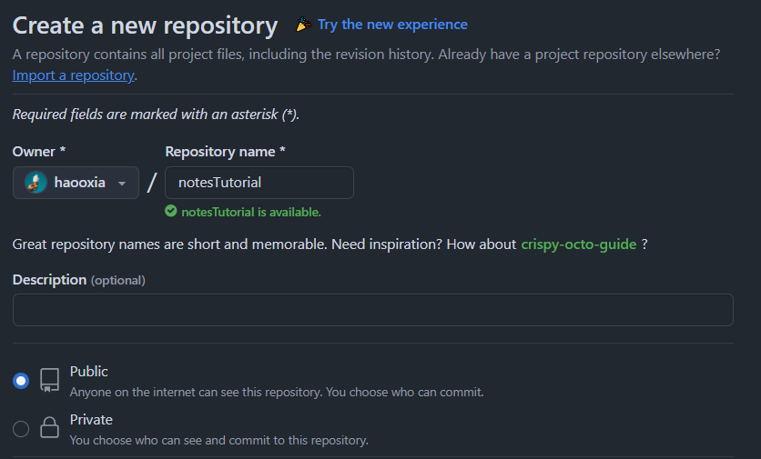
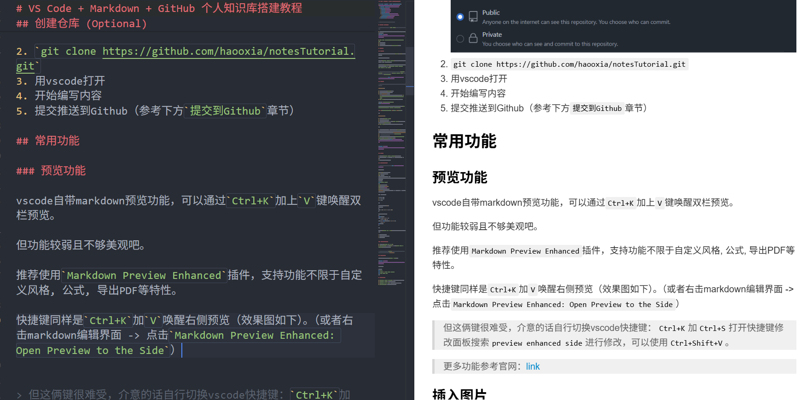
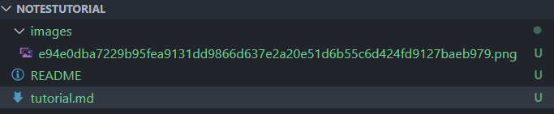
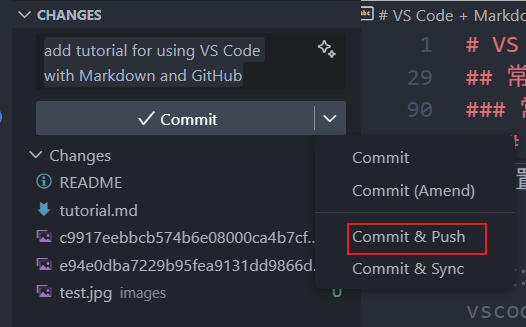

# VS Code + Markdown + GitHub 个人知识库搭建教程

- [VS Code + Markdown + GitHub 个人知识库搭建教程](#vs-code--markdown--github-个人知识库搭建教程)
  - [创建仓库 (Optional)](#创建仓库-optional)
  - [常用功能](#常用功能)
    - [预览功能](#预览功能)
    - [插入图片](#插入图片)
    - [导出PDF](#导出pdf)
    - [常用markdown命令](#常用markdown命令)
      - [常用命令](#常用命令)
      - [代码](#代码)
      - [表格](#表格)
      - [公式](#公式)
      - [目录](#目录)
    - [提交到Github](#提交到github)
  - [推荐插件汇总](#推荐插件汇总)

> 方案优势：数据自主, 通用Markdown格式, 高效编辑, 版本控制, 便于迁移

## 创建仓库 (Optional)

> 已有仓库请忽略此步，直接`git clone`到本地然后用vscode打开即可

1. 打开github，创建一个新的repository。如果打算私有，可以设置为Private
  

2. `git clone https://github.com/{ownerName}/{repoName}.git`
3. 用vscode打开
4. 开始编写内容
5. 提交推送到Github（参考下方`提交到Github`章节）

## 常用功能

### 预览功能

vscode自带markdown预览功能，可以通过`Ctrl+K`松开再按`V`键唤醒双栏预览。（但其功能相对基础，且不够美观，故不推荐）

推荐使用`Markdown Preview Enhanced`插件，支持功 能不限于自定义风格, 公式, 导出PDF等特性。

快捷键同样是`Ctrl+K`加`V`唤醒右侧预览（效果图如下）。（或者右击markdown编辑界面 -> 点击`Markdown Preview Enhanced: Open Preview to the Side`）

  

> 但这俩键很难受，可以考虑自行切换vscode快捷键：`Ctrl+K`加`Ctrl+S`打开快捷键修改面板搜索`preview enhanced side`进行修改，可以使用`Ctrl+Shift+V`。

> 更多功能参考官网：[link](https://shd101wyy.github.io/markdown-preview-enhanced/#/zh-cn/)

### 插入图片

> * 直接将图像存到项目中，比折腾图床更简单、安全和稳定
> * 为了整洁，建议将图像存入固定文件夹，而非与markdown文件并列同级目录
> * 所以虽然`Ctrl+V`就可以直接粘贴图片到同级目录下一起上传，但不推荐

**手动方法**：
1. 在项目根目录创建`images`文件夹 (如未创建)
2. 手动复制粘贴图片存入该文件夹
3. 复制**相对路径**并引用
   1. 相对路径即从你当前markdown文件所在位置出发到`images`文件夹的路径。e.g., `./images/test1.jpg`, `../../images/test2.jpg`等
   2. 网络URL则无需下载，直接引用即可加载显示。e.g., ``
4. `git push`的时候把图片和markdown文件都一起提交即可

引用指令: ``


如需指定图像大小，可利用该HTML格式指令设置图像宽度：``


---

**全自动方法**:

1. 安装插件`Markdown Image`
2. 右击markdown编辑界面 -> 点击`Paste Image`即可粘贴剪贴板中复制的图像。（或者使用默认快捷键`Shift+Alt+V`）
3. `git push`的时候把图片和markdown文件都一起提交即可

---

详细事项：

1. 按快捷键后该插件会自动在项目根目录下新建一个`images`文件夹（如不存在），然后会把剪切板中的图像粘贴到该文件夹（参见下图），同时自动在markdown中创建图像代码。（**即手动方法的步骤1-3**）
   1.   
2. 不论你在项目的哪一层级目录的markdown文件中，该插件都只会默认将图像保存到根目录下
3. 首次插入图像可能较慢
4. > 快捷键同样绕手，可以考虑修改为`Ctrl+Shift+I`
5. 如果需要频繁修改图像尺寸，推荐将`markdown-image.base.codeType`从`Markdown`设置为`HTML`格式
6. 更多设置参考官方教程：[link](https://github.com/imlinhanchao/vsc-markdown-image/blob/HEAD/README.zh-cn.md)

### 导出PDF

* 基于插件`Markdown Preview Enhanced`打开预览窗口
* 在pdf上右击鼠标 -> 点击Export -> Chrome(Puppetter) -> PDF
* 打印的pdf会存在当前目录

### 常用markdown命令

> markdown常见命令参考网页：[link](https://markdown-it.github.io/)

#### 常用命令

> 对比源码观看

`*`或者`-`用于创建无序列表
`1. `用于创建有序列表
`> text`用于引用
`---`用于绘制分割线
`**text**`用于加粗：**加粗**     
`*text*`用于斜体：*斜体*  
`~~text~~`用于删除：~~删除线~~
`<mark>text</mark>`用于标记：<mark>标记</mark> (github支持)
> `==text==`用于高亮：==高亮== (github不支持)

**超链接**快捷创建方式：先复制URL -> 写描述文字 -> 选中描述文字按粘贴键即可形成: `[描述文字](URL)`

**TODO List**创建方式：

- [x] do sth1
- [ ] do sth2
- [ ] ...

#### 代码

单个反引号用于inline code：e.g., `xxx`
三个反引号```用于创建代码块（加上对应边编程语言可以高亮显示，示例如下：
```python
# python code example
print("hello world")
```

```shell
# shell code example
echo "hello world"
```

#### 表格

| name | age | city |
|------|------|------|
| xiaoli | 25   | Beijing |
| xiaoming | 30   | Shanghai |

> 有点繁琐，可以让gpt等自动给出markdown格式的表格

#### 公式

行内公式：$f(x)=x^2+2x+1$

单行公式（支持LaTex）：
$$
x = \frac{-b \pm \sqrt{b^2 - 4ac}}{2a}
$$

> 但Github界面渲染公式应该有问题，可以使用谷歌插件`MathJax Plugin for Github`解决...

---

最后推荐一个插件：`Markdown All in One`，可以很大程度上提升编辑效率，功能包括但不限于：

* 快捷键：使用 `Ctrl+B` 加粗，`Ctrl+I` 斜体等
* 智能列表：在列表项后按回车，会自动生成下一项的标记
* 自动生成目录

#### 目录

1. 下载插件`Markdown All in One`
2. `Ctrl+Shift+P` -> 输入`toc` -> 选择`Create Table of Contents`即可在相应位置创建


> 注：虽然直接通过指令`[toc]`生成，vscode可以成功渲染，但github界面无法渲染成功（**不推荐**）

---

上述针对文件内目录自动生成，对于多文件的目录，如：你想在`README.md`中列出所有文件的目录，可以自行构造，示例如下：

* [Operating System](https://github.com/haooxia/CSJourney/blob/main/os/os_essence.md)
* [Computer Networks](https://github.com/haooxia/CSJourney/blob/main/network/network_essence.md)


### 提交到Github

直接使用vscode可视化工具`commit & push`即可

  

或者命令行:

```shell
git add .
git commit -m "your commit message"
git push origin main
```

## 推荐插件汇总

1. `Markdown Preview Enhanced`: 用于增强markdown预览功能
2. `Markdown Image`: 用于自动插入图片
3. `Markdown All in One`: 用于增强markdown编辑功能
4. `Markdownlint`: 用于markdown语法检查 (如果严格要求语法规范的话)